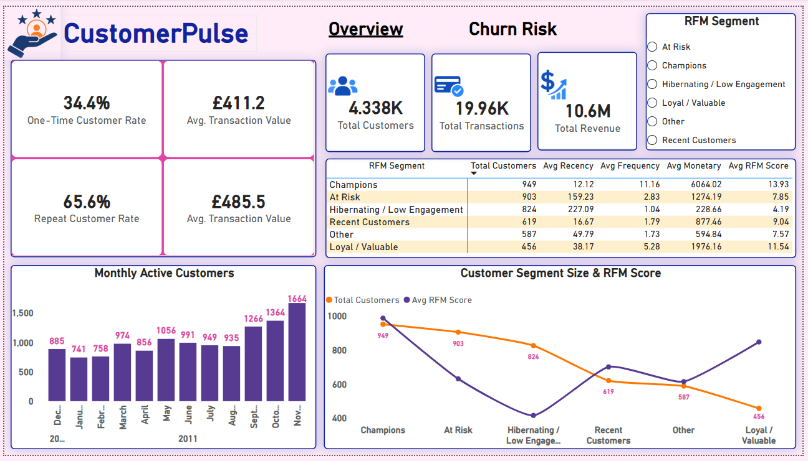
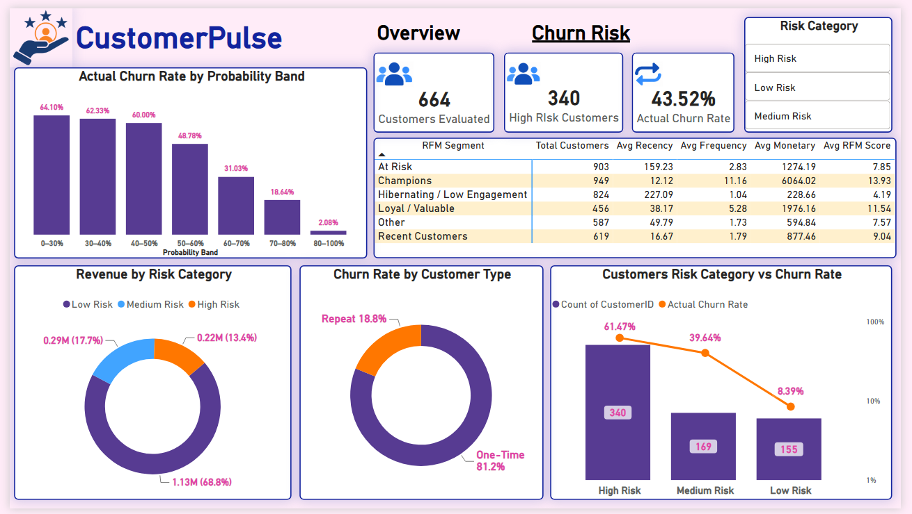

# CustomerPulse : Retention & Churn Analysis

End-to-end analysis of online retailer's transaction data (Dec 2010 – Dec 2011) : cleaning raw sales data, segmenting customers with RFM, and predicting future retention with a Logistic Regression model — surfaced in a Power BI dashboard.

**Objective** : Identify which customers are likely to stop purchasing before they actually churn, and turn that into a segmented, actionable retention strategy — rather than reacting to lost customers after the fact.

## Workflow
```text
Raw Transactions → Cleaning → EDA (Sales/Product/Country) → RFM Segmentation
 → Churn Definition (90-day forward window) → Logistic Regression
→ Risk Scoring → Power BI Dashboard
```

## Data
- Source : Online Retail transaction log — 541,909 rows, 4,372 customers, 38 countries
- Cleaned sales dataset : 524,878 rows (duplicates, cancellations, and invalid price/quantity rows removed)
- Cleaned customer dataset : 392,692 rows / 4,338 unique customers with a valid Customer ID

## Tech Stack

| Tool | Role |
|------|------|
| **Python / Pandas / NumPy** | Data cleaning, aggregation, and feature engineering |
| **Jupyter Notebooks** | Sequential analysis (`00_project_setup` → `07_retention_prediction`) |
| **Matplotlib / Seaborn** | EDA visualizations |
| **DuckDB (SQL)** | Cross-validating Python aggregations and building time-windowed features |
| **scikit-learn** | Train/test split, scaling, Logistic Regression, and model evaluation |
| **Power BI** | **CustomerPulse** interactive dashboard |

## Key Outcomes

### 1. Business performance

- £10.64M total revenue · 19,962 transactions · 4,338 customers · £533 avg. transaction value
- Revenue surged into autumn : £1.06M (Sep) → £1.15M (Oct) → £1.50M (Nov) — the strongest month in the dataset
- 65.6% of customers are repeat buyers, generating 93% of customer revenue

### 2. RFM Segmentation (6 behavioral segments across 4,338 customers)

| RFM Segment | Customers | Avg. Spend |
|---|---:|---:|
| Champions | 949 | £6,064 |
| At Risk | 903 | £1,274 |
| Hibernating / Low Engagement | 824 | £229 |
| Recent Customers | 619 | £877 |
| Other | 587 | £595 |
| Loyal / Valuable | 456 | £1,976 |

### 3. Churn Prediction Model (Logistic Regression, 3 features, 664-customer holdout test set)

- Accuracy 68.2% · Precision 75.3% · Recall 65.1% · ROC-AUC 0.739
- Customers scored in the model's lowest retention-probability band churned 64% of the time vs. 2% in the highest band
- High Risk tier (51% of test customers) : 61.5% actual churn rate, vs. 8.4% in Low Risk — a 7.3x spread
- Strongest churn driver : order count (odds ratio 3.51) — customers who've already ordered more are far more likely to return

**Note :** Retention, not acquisition, drives this business. The model reliably separates customers into risk tiers with a 7.3x real-world churn-rate spread, giving marketing and customer success teams a clear, prioritized list of who to target — especially the 903-customer `At Risk` segment, which still holds strong historical value but hasn't purchased in an average of 159 days.


### 4. Dashboard

- Power BI "CustomerPulse" report with Overview and Churn Risk pages — live RFM segment breakdown, churn-probability bands, and revenue-at-risk by tier.





## Repository Structure

```text
├── notebooks/           # 00_project_setup → 07_retention_prediction
├── dashboard/           # Power BI dashboard screenshots
├── powerbi/             # Power BI source
└── README.md
```
